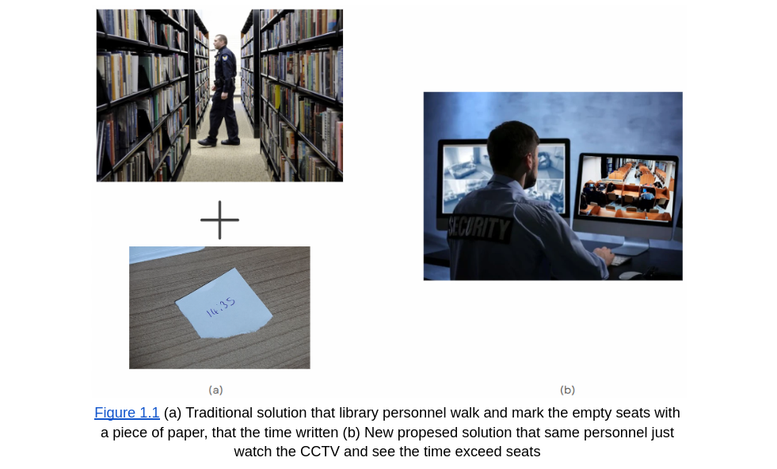
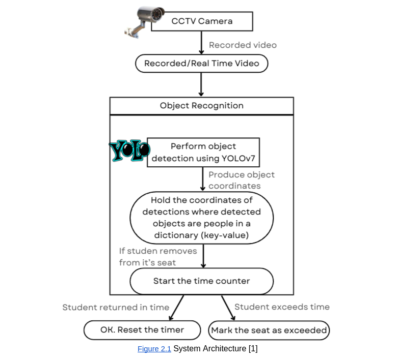
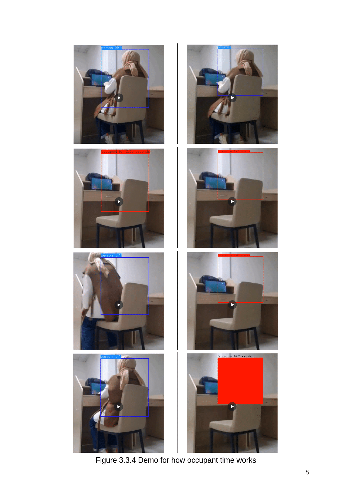

<div align="center">
<h2>
    SeatWatch: Advanced Library Seat Occupancy Detection 📚
</h2>
<div>
    
</div>
<div>
  <a target="_blank" href="https://colab.research.google.com/github/asumansaree/Library-Seat-Occupancy-Detection"></a>
</div>
</div>


## 🌟 Project Description

With using  YOLOv7 on video cameras detecting the occupancy time (with belongings, without human) of the seats in the library



Detailed explanation about the project is in this document:
[Document](https://docs.google.com/document/d/1pJ2VXuCuY54If5JJqTePYmlqCHkCWHwM6suYYAaN2k4/edit?usp=sharing)

# 🛠️ System Architecture



## 📜 Installation

```bash
git clone https://github.com/asumansaree/Library-Seat-Occupancy-Detection
cd Library-Seat-Occupancy-Detection
pip install -r requirements.txt
```

## 🤗 Usage

```bash
python detect_and_track.py \
    --weights yolov7.pt \
    --source "test.mp4" \
    --conf-thres 0.4 \
    --classes 0 56 \
    --name "YOLOV7_Library_Seat_Detection" \
```

## 🚀 Sample Output

Output file will be created in the 
```
"/content/Library-Seat-Occupancy-Detection/runs/detect/YOLOV7_Library_Seat_Detection/{video.mp4}"
```
Output is in the mp4 format. For demonstration purposes in pdf document, it is included as image


<br clear="left"/>

## 💬 Contact
Contact me for any problem and question
asumansaree@gmail.com

## 🙏 References

* https://github.com/RizwanMunawar/yolov7-object-tracking
* Anish Aralikatti et al 2020 J. Phys.: Conf. Ser. 1706 012149
* Redmon J, Divvala S, Girshick R and Farhadi A You Only Look Once: Unified, Real-Time Object 
  Detection 2016IEEE Conference on Computer Vision and Pattern Recognition (Las Vegas) pp 779-788 
* COCO 2017 dataset: http://cocodataset.org
